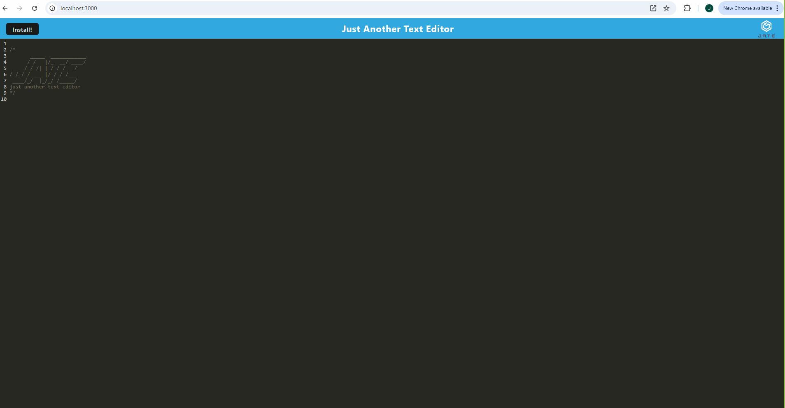

# PWA-Text-Editor

## Table of Contents
- [PWA-Text-Editor](#pwa-text-editor)
  - [Table of Contents](#table-of-contents)
  - [Description](#description)
  - [Installation](#installation)
  - [Usage](#usage)
  - [License](#license)
  - [Questions](#questions)

## Description

This is a PWA that allows users to install and edit text in a local browser.

## Installation

Going to the deployed site [here](https://pwa-text-editor-d6s6.onrender.com) there will be a button that says install. Once install is clicked it will be installed.

## Usage

It is a test editor application that stores user input locally.

## License
    This project is covered under the MIT license.
[Link](https://opensource.org/licenses/MIT)

## Questions
My [GitHub](https://github.com/Jrsparling) profile

Got questions? Reach out to me via email: [Jsparlingzi3757@gmail.com](mailto:Jsparlingzi3757@gmail.com)